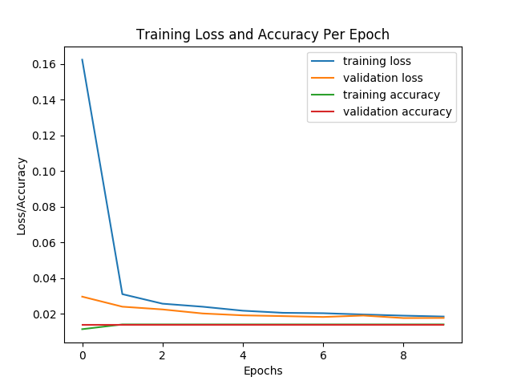
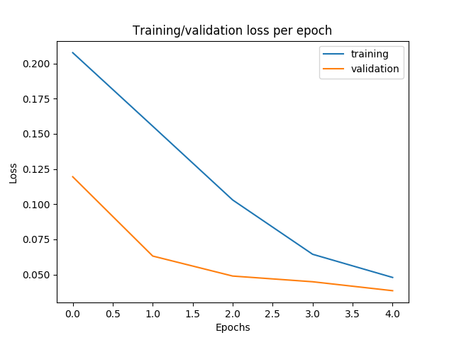
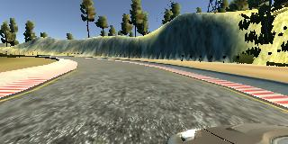
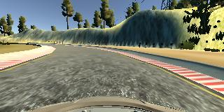
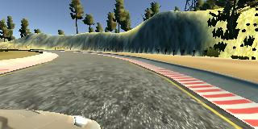

# Behavioural Cloning Project

> **Use Deep Learning to Clone Driving Behavior** by building a convolution neural network in Keras that predicts steering angles from images, and is trained, validated and tested with the appropriate data sets. In the end the trained model should be able to drive the simulation around track one (optionally track two). The work is reported in this README.

## Rubric Points

The following checklist needs to be implemented in order for the project to succeed.

### Files Submitted & Code Quality

- [ ] 1. The submission includes a `model.py` file, `drive.py`, `model.h5` a writeup report (`README.md`) and `video.mp4`.

- [ ] 2. The model provided can be used to successfully operate the simulation.
- [ ] 3. The code in `model.py` uses a Python generator, if needed, to generate data for training rather than storing the training data in memory. The `model.py` code is clearly organized and comments are included where needed.

### Model Architecture and Training Strategy

- [ ] 1. The neural network uses convolution layers with appropriate filter sizes. Layers exist to introduce nonlinearity into the model. The data is normalized in the model.
- [ ] 2. Train/validation/test splits have been used, and the model uses dropout layers or other methods to reduce overfitting.
- [ ] 3. Learning rate parameters are chosen with explanation, or an Adam optimizer is used.
- [ ] 4. Training data has been chosen to induce the desired behavior in the simulation (i.e. keeping the car on the track).

### Architecture and Training Documentation

- [ ] 1. The `README` *thoroughly* discusses the approach taken for deriving and designing a model architecture fit for solving the given problem.
- [ ] 2. The `README` provides sufficient details of the characteristics and qualities of the architecture, such as the type of model used, the number of layers, the size of each layer. Visualizations emphasizing particular qualities of the architecture are encouraged. [Here](http://alexlenail.me/NN-SVG/LeNet.html) is one such tool for visualization.
- [ ] 3. The `README` describes how the model was trained and what the characteristics of the dataset are. Information such as how the dataset was generated and examples of images from the dataset must be included.

### Simulation

- [ ] No tire may leave the drivable portion of the track surface. The car may not pop up onto ledges or roll over any surfaces that would otherwise be considered unsafe (if humans were in the vehicle).

###  Stand Out!

- [ ] The simulator contains two tracks. To meet specifications, the car must successfully drive around track one. Track two is more difficult. See if you can get the car to stay on the road for track two as well.

## Notes

- Sample Data: there is sample driving data available in the workspace but this needs augmentation and additional data from driving myself.
- Simulator: use mouse, R shorcut for recording. W or S suspend auto mode. Use smallest and fastest screen setting in simulator
- Data collection:
  - the car should stay in the center of the road as much as possible but we probably need
    - two or three laps of center lane driving
    - one lap of recovery driving from the sides
    - one lap focusing on driving smoothly around curves
  - if the car veers off to the side, it should recover back to center
  - driving counter-clockwise can help the model generalize
  - flipping the images is a quick way to augment the data
  - collecting data from the second track can also help generalize the model
  - we want to avoid overfitting or underfitting when training the model
  - knowing when to stop collecting more data
- steering is from -1 to 1 (tanh ?) in simulator angle of -25 to 25 degree
- three camera viewpoints per timestamp + sensor data. steering only concidered in this project
- ~~can use scp to copy training data from local simulator to remote GPU instance~~
- If model predictions are poor on both the training and validation set (for example, mean squared error is high on both), then this is evidence of underfitting. Possible solutions could be to
  - increase the number of epochs
  - add more convolutions to the network.
- When the model predicts well on the training set but poorly on the validation set (for example, low mean squared error for training set, high mean squared error for validation set), this is evidence of overfitting. If the model is overfitting, a few ideas could be to
  - use dropout or pooling layers
  - use fewer convolution or fewer fully connected layers
  - collect more data or further augment the data set
- Augment by flipping, brightness etc the data (and angle) with keras tf.image features
- use side images and add correction to steering maybe even trig function to generate values (Project, Concept 13)
- preprocess images by cropping top 70 and bottom 25, Cropping2D(cropping=((70,25),(0,0)))
- start with simple network to check basic setup/workflow, then try e.g Lenet or something else to improve. then simultanously try preprocessing techniques

## Writeup

### Workflow

Two clones of the project should exist, one in the Udacity workspace and the other on a local machine which both point to the main [repository](https://github.com/joustava/CarND-Behavioral-Cloning-Project). Collection of training data was done on a local MacBook Pro (2013) and training of the model is done on the GPU enabled workspace. Other tasks which do not require a GPU, such as major coding tasks, documenting, graphing and the writeup were done locally as to not waste GPU time.

Collection of data is done via a simulator, one needs to drive the car around the track using several driving tactics while recording. This data then has been uploaded as a compressed zip file to the GPU enabled workspace. On the workspace, this file can been unpacked in the `/opt` directory. When the compressed zip file is not to big in size (> 300mb) it is advised to upload it to the workspace directory to then unpack it with `unzip <samples_file>.zip -d /opt/` this removes the need of having to upload the samples each time when the workspace is restarted.

Each newly trained model is saved as `./models/model.h5`and as to not overwrite older models the previous files are backed up with their modification timestamp in the file name e.g `model_1607426211.5h`. With big models that have many parameters, this can lead to getting out of disk space thus it is advised to not store a great number of backups and keep the important models in some other storage such as e.g Dropbox or Google Drive.

Versions used:

```bash
$ python --version
Python 3.6.3
$ python -c "import keras; print(keras.__version__)"
2.0.9
$ python -c "import tensorflow; print(tensorflow.__version__)"
1.3.0
$ pip install pydot # Needs to be installed (v 1.4.1) for plotting certain graphs with keras.
```

### Files Submitted & Code Quality

#### 1. Submission includes all required files and can be used to run the simulator in autonomous mode

My project includes the following required files:
* `./src/model.py` containing the script to create and train the model
* `./tools/drive.py` for driving the car in autonomous mode
* `./models/model.h5` containing a trained convolution neural network 
* `README.md` summarizing the results (this is what you are reading right now)
* `./assets/video.mp4` showcasing the simulation conquer track one.

The major structure of my project files summarized:

```bash
.
├── .gitignore 						# configured as to not upload huge amount of unnecessary data
├── LICENSE
├── Makefile							# helper targets for the make utility
├── assets								# contains trained models
│   ├── plots							# plots of training results
│   └── cameras						# camera img examples for writeup
├── data									# this is not committed to this repo but compressed and uploaded to /opt
│   ├── IMG								# camera images
│   └── driving_log.csv		# sensor log
├── models								# contains trained models temporarily before moving to e.g Dropbox
│   └── .gitkeep
├── src										# Code to train and create models
│   ├── augmentation.py
│   ├── data.py
│   ├── plotter.py
│   ├── predict.py
│   └── model.py
└── tools									# the original provided tools for simulation and recording
    ├── drive.py
    └── video.py
```


#### 2. Submission includes functional code

Using the Udacity provided simulator in an appropriate workspace  and the `./tools/drive.py` file, the car can be driven autonomously around the track by executing 

```sh
$ python drive.py model.h5
```

or

```bash
$ make simulation
```

The car in the simulator will then start driving and attempt to navigate around the track without leaving the road.

If no `model.h5` file is available it can be generated anew by running

```bash
$ python ./src/model.py
```

or

```bash
$ make training
```

This may take several minutes on a GPU enabled workspace.

If training fails, due to not being able to find the samples in `/opt` folder then these need to be uploaded to the workspace and unzipped first.

#### 3. Submission code is usable and readable

The `./scr/model.py` file contains the code for training and saving the convolution neural network. The file shows the pipeline used for training and validating the model and it contains comments to explain how the code works. Secondary functionality such as loading data, saving the models and generating test data has been split up into independent files and imported into `./src/model.py` accordingly. These files are also extensively commented and documented.

### Model Architecture and Training Strategy

#### 1. An appropriate model architecture has been employed

My final model consists of several convolution layers with 5x5 and 3x3 filter sizes all having the same depth of 32. [link] Which are connected to several Fully Connected layers through a Flatten layer.

The model includes *softsign* activation functions to introduce nonlinearity [link] and the input data is normalized and preporcessed in the model using a Keras lambda layer [link]

#### 2. Attempts to reduce overfitting in the model

The model contains dropout layers between each Fully Connected layer in order to reduce overfitting [(model.py lines 21). ]

The model was trained with 70% of the sample data and validated with the remaining 30% fo the data through randomized batch sets to ensure that the model was not overfitting[link]. The model was tested by running it through the simulator and ensuring that the vehicle could stay on the track.

#### 3. Model parameter tuning

The model uses the [Adam](https://keras.io/api/optimizers/adam/) optimizer, in which the learning rate does not need to be  tuned manually and this optimizer will start learning with a rate of 0.001. [link to line in repo]. Hyperparameters and additional information about the resulting network  is covered in the Final Model Architecture section.

#### 4. Appropriate training data

[TBD]The training data consists solely of samples taken during three uninterrupted laps on track one. Each sample is expanded by using all three images with steering angle corrected for each left and right camera based on the original angle. Improving generalisation of the model was done by once more extending sample size by generation of horizontally flipped images of the left and right camera and the steering angle.

For details about how I created the training data, see the next section. 

### Architecture and Training Documentation

#### 1. Solution Design Approach

The overall strategy for deriving a model architecture was to incrementally build, train and validate a model and subsequently test the model with the simulator whenever there was significant improvement in driving behaviour. Looking at the accuracy of both training and validation has no real value in this case as we are not solving  a classification problem. 

#### Basic network

The first step was to create a basic project setup for loading the sample data, preparing and preprocessing the data and then train a simple network which only consisted of only a few layers.

```python
# ... omitted
model = Sequential()
# Preprocess
model.add(Lambda(lambda x: x/127.5 - 1.,
                 input_shape=input_shape, output_shape=input_shape))
# Layers
model.add(Flatten())
model.add(Dense(1))
model.compile(loss='mse', optimizer='adam')
# ... omitted
```

The produced model can be found in [`./models/model01.h5`](./models/model01.h5) under epository [tag model01](https://github.com/joustava/CarND-Behavioral-Cloning-Project/tree/model01) as well ass the accompanying source code. The model did not do well in the simulator, after about 10 seconds the car drove of track into the woods and the model was driving very unsure, steering all over the place however, while building this simple network we created a project structure and tooling to support further research.

#### LeNet based network iteration

Secondly, a LeNet like network was build and trained with the original data. This model was conciderable more certain in steering and drove more stable for about 20 seconds. It started aiming for the red and white borders and got stuck on the right side 'concrete' ledge. Not a success either.

Before trying out a new neural network model, additional data was pulled into the training data in the form of the left and right camera feeds and their adjusted steering angles. Training on this data, which was tripled in size, did not reduce loss (around 1.1055 mostly) and thus a dropout layer was added between each dense layer, each with a dropout rate of 0.5, to reduce overfitting. The training result output is plotted below

```bash
112/112 [==============================] - 50s 443ms/step - loss: 0.0538 - val_loss: 0.0036
Epoch 2/10
112/112 [==============================] - 46s 414ms/step - loss: 0.0065 - val_loss: 0.0027
Epoch 3/10
112/112 [==============================] - 46s 412ms/step - loss: 0.0049 - val_loss: 0.0028
Epoch 4/10
112/112 [==============================] - 46s 412ms/step - loss: 0.0041 - val_loss: 0.0024
Epoch 5/10
112/112 [==============================] - 46s 412ms/step - loss: 0.0039 - val_loss: 0.0023
Epoch 6/10
112/112 [==============================] - 46s 413ms/step - loss: 0.0035 - val_loss: 0.0022
Epoch 7/10
112/112 [==============================] - 46s 412ms/step - loss: 0.0032 - val_loss: 0.0021
Epoch 8/10
112/112 [==============================] - 46s 413ms/step - loss: 0.0033 - val_loss: 0.0024
Epoch 9/10
112/112 [==============================] - 46s 412ms/step - loss: 0.0029 - val_loss: 0.0022
Epoch 10/10
112/112 [==============================] - 46s 412ms/step - loss: 0.0027 - val_loss: 0.0022
```

These look like good training results but again the simulator just drove on center for a while to then start tracking the road along the outside of the left bank. One more step to the data processing was added to crop the images such that the horizon above the road surface and the hood of the car were cropped from each image. The results of the training were similar to the training applied above, however the simulator still ran off track pretty soon.

```bash
name: Tesla K80, pci bus id: 0000:00:04.0)
112/112 [==============================] - 35s 310ms/step - loss: 0.0404 - val_loss: 0.0113
Epoch 2/10
112/112 [==============================] - 30s 267ms/step - loss: 0.0129 - val_loss: 0.0097
Epoch 3/10
112/112 [==============================] - 30s 268ms/step - loss: 0.0113 - val_loss: 0.0087
Epoch 4/10
112/112 [==============================] - 30s 268ms/step - loss: 0.0103 - val_loss: 0.0086
Epoch 5/10
112/112 [==============================] - 30s 268ms/step - loss: 0.0098 - val_loss: 0.0081
Epoch 6/10
112/112 [==============================] - 30s 267ms/step - loss: 0.0091 - val_loss: 0.0078
Epoch 7/10
112/112 [==============================] - 30s 268ms/step - loss: 0.0087 - val_loss: 0.0078
Epoch 8/10
112/112 [==============================] - 30s 270ms/step - loss: 0.0084 - val_loss: 0.0079
Epoch 9/10
112/112 [==============================] - 30s 270ms/step - loss: 0.0082 - val_loss: 0.0074
Epoch 10/10
112/112 [==============================] - 30s 270ms/step - loss: 0.0079 - val_loss: 0.0075
```

These previous results made me start to inspect the data more closely. Made predictions for the outputs for center, left and right images on this network were as follows

```bash
TBD: Check from lenet branch
./assets/center_2020_12_08_10_46_19_361.jpg
# Car is near center of lane
CENTER:  [0.32672474] 
LEFT:      [0.20746137] 
RIGHT:     [0.35259765] 

 ./assets/left_2020_12_08_10_46_19_361.jpg
# Car is near 
CENTER:  [0.09711259] 
LEFT:      [-0.06863123] 
RIGHT:     [0.09685086] 

 ./assets/right_2020_12_08_10_46_19_361.jpg
CENTER:  [0.2572524] 
LEFT:      [0.22326781] 
RIGHT:     [0.20886575] 
```

Which look ok at a first glance. Next I created a plot of the training data to better visualize the training performance. The output below also depicts accuracies during the training but these values can be discarded as they have no real value in checking the performance of this particular model.

```bash
Epoch 1/10
25/25 [==============================] - 42s 2s/step - loss: 0.1602 - acc: 0.0112 - val_loss: 0.0295 - val_acc: 0.0139
Epoch 2/10
25/25 [==============================] - 31s 1s/step - loss: 0.0308 - acc: 0.0138 - val_loss: 0.0239 - val_acc: 0.0139
Epoch 3/10
25/25 [==============================] - 34s 1s/step - loss: 0.0256 - acc: 0.0138 - val_loss: 0.0224 - val_acc: 0.0139
Epoch 4/10
25/25 [==============================] - 33s 1s/step - loss: 0.0239 - acc: 0.0138 - val_loss: 0.0201 - val_acc: 0.0139
Epoch 5/10
25/25 [==============================] - 33s 1s/step - loss: 0.0216 - acc: 0.0138 - val_loss: 0.0190 - val_acc: 0.0139
Epoch 6/10
25/25 [==============================] - 32s 1s/step - loss: 0.0204 - acc: 0.0138 - val_loss: 0.0186 - val_acc: 0.0139
Epoch 7/10
25/25 [==============================] - 33s 1s/step - loss: 0.0203 - acc: 0.0138 - val_loss: 0.0181 - val_acc: 0.0139
Epoch 8/10
25/25 [==============================] - 32s 1s/step - loss: 0.0195 - acc: 0.0138 - val_loss: 0.0189 - val_acc: 0.0139
Epoch 9/10
25/25 [==============================] - 32s 1s/step - loss: 0.0189 - acc: 0.0138 - val_loss: 0.0175 - val_acc: 0.0139
Epoch 10/10
25/25 [==============================] - 32s 1s/step - loss: 0.0183 - acc: 0.0138 - val_loss: 0.0176 - val_acc: 0.0139
```

The plot of these values can be found from figure 1 below. As mentioned accuracy is not a good metric in a non-classification problem as we try to solve here, thus these values can be discarded.

| Figure 1. Loss and Accuracy plotted over epochs for LeNet based model |
| ------------------------------------------------------------ |
|  |

Training loss goes down very steep while the validation loss stays approximately the same.

The produced model can be found in [`./models/model01.h5`](./models/model01.h5) under epository [tag model02](https://github.com/joustava/CarND-Behavioral-Cloning-Project/tree/model02) as well as the accompanying source code at this point in time.

#### Model 3 network iteration

Changes:

- generato batch 32 (bigger gives OOM)
- angle correction 0.3
- loss went down eac hepoch, raised nr of epochs. (but too low loss resulted in overfitting as the car started to follow lines too closely)
- removed most pooling layers, add one dropout with low rate between convolution
- found that keeping loss relatively high kept the smiulator from aiming for the sides of the road, of course quality of sampling has to do with this as well. however the car now was able to drive till just after the bridge in the first track. The epochs are numbered off by one in this plot,.

| Fig 2. Training and validation Loss, model 03                |
| ------------------------------------------------------------ |
|  |


#### Model 4 network iteration

For this model, I started focussing on the proper handling of sample data. There was already a generator in place to do more efficient handling but according to the keras docs: *Sequence [keras.utils.Sequence()] are a safer way to do multiprocessing. This structure guarantees that the network will only train once on each sample per epoch which is not the case with generators.* Therefore I wrote a custom batch handling class based on keras.utils.Sequence, named [CustomDataGenerator](src/augmentation.py)

Also, to be able to let the model generalize better, we  need to think about augmenting the data. The CustomDataGenerator's `__create_batch` method was refactored to include generation of flipped verisons of both left and right camera images (and their adjusted labels). This made the size of each sample approximately five times bigger, which we need to keep in mind when we try to handle batches effeciently memory wise to avoid Out Of Memory(OOM) errors. Augmenting the samples by adding flipped left and right images, improved the driving experience somewhat in length as it went trough the bend after the bridge, albeit with some near death experiences for the virtual driver, the success ended in the lake in the second right bend after the bridge.

By now I also experimented so much that one thing I noticed is that when the loss is kept around  **~0.050** to **~0.040** the car manages to follow the track for the longest periods without changing current hyperparams.

Last, the `model.h5` files saved for model03 became bigger and bigger in file size (~1Gb) because no scaling down was happening between convolutional layers apart from one dropout layer with a very low 0.1 dropout rate and a MaxPool. As model 03 architecture wasn't changed yet, an **AveragePooling2D** layer was placed between all Convolutional layers instead to create model 04. The driving behaviour did not improve after these changes so I opted to add an extra **Fully Connected** layer with dimension 50 right before the output layer. Together with changes to dropout (0.7), epochs (10), batches (64) I finally got the simulator do at least **one round on track 1!**

The raw output of the training and a plot of the same data is shown below.

```bash
Epoch 1/10
49/49 [==============================] - 57s 1s/step - loss: 0.2567 - val_loss: 0.1330
Epoch 2/10
49/49 [==============================] - 53s 1s/step - loss: 0.2184 - val_loss: 0.1126
Epoch 3/10
49/49 [==============================] - 53s 1s/step - loss: 0.1847 - val_loss: 0.0946
Epoch 4/10
49/49 [==============================] - 53s 1s/step - loss: 0.1432 - val_loss: 0.0775
Epoch 5/10
49/49 [==============================] - 53s 1s/step - loss: 0.1083 - val_loss: 0.0665
Epoch 6/10
49/49 [==============================] - 52s 1s/step - loss: 0.0785 - val_loss: 0.0575
Epoch 7/10
49/49 [==============================] - 52s 1s/step - loss: 0.0644 - val_loss: 0.0526
Epoch 8/10
49/49 [==============================] - 53s 1s/step - loss: 0.0566 - val_loss: 0.0500
Epoch 9/10
49/49 [==============================] - 53s 1s/step - loss: 0.0524 - val_loss: 0.0458
Epoch 10/10
49/49 [==============================] - 52s 1s/step - loss: 0.0485 - val_loss: 0.0463
```

The plot in figure 3 shows both training and validation losses smoothly converging towards the tenth epoch.

| Figure 3. Loss  plotted over epochs for model 04.            |
| ------------------------------------------------------------ |
|  |

At the end of this process, the vehicle is able to drive autonomously around track one without leaving the road.

[TBD] explain plots

- convergence over epochs (slope).

- plateau of the line

- over-learning the training data (inflection for validation line).

- Since this model outputs a single continuous numeric value, one appropriate error metric would be mean squared error. If the mean squared error is high on both a training and validation set, the model is underfitting. If the mean squared error is low on a training set but high on a validation set, the model is overfitting. Collecting more data can help improve a model when the model is overfitting.

  What if the model has a low mean squared error on both the training and validation sets, but the car is falling off the track?

  Try to figure out the cases where the vehicle is falling off the track. Does it occur only on turns? Then maybe it's important to collect more turning data. The vehicle's driving behavior is only as good as the behavior of the driver who provided the data.

  

Future experiments:

[TBD ]Then size of set and removing duplication (losts of images similar as they are made fractions of seconds from each other), try sampling 50% before augmenting

[TBD] Early stoppping loss value as noticed around certain loss the simulation is more capable to drive the track

[TBD] Random augmentation of images and angle e.g brightness blur etc.

[TBD] Collect recovery data of tricky sections. 

#### 2. Final Model Architecture

The final model architecture consisted of a convolution neural network with the following layers and layer sizes:

```bash
Layer (type)                 Output Shape              Param #   
=================================================================
cropping2d_1 (Cropping2D)    (None, 90, 320, 3)        0         
_________________________________________________________________
lambda_1 (Lambda)            (None, 90, 320, 3)        0         
_________________________________________________________________
conv2d_1 (Conv2D)            (None, 86, 316, 32)       2432      
_________________________________________________________________
average_pooling2d_1 (Average (None, 43, 158, 32)       0         
_________________________________________________________________
conv2d_2 (Conv2D)            (None, 39, 154, 32)       25632     
_________________________________________________________________
average_pooling2d_2 (Average (None, 19, 77, 32)        0         
_________________________________________________________________
conv2d_3 (Conv2D)            (None, 17, 75, 32)        9248      
_________________________________________________________________
flatten_1 (Flatten)          (None, 40800)             0         
_________________________________________________________________
dense_1 (Dense)              (None, 512)               20890112  
_________________________________________________________________
dropout_1 (Dropout)          (None, 512)               0         
_________________________________________________________________
dense_2 (Dense)              (None, 256)               131328    
_________________________________________________________________
dropout_2 (Dropout)          (None, 256)               0         
_________________________________________________________________
dense_3 (Dense)              (None, 50)                12850     
_________________________________________________________________
dropout_3 (Dropout)          (None, 50)                0         
_________________________________________________________________
dense_4 (Dense)              (None, 1)                 51        
=================================================================
Total params: 21,071,653
Trainable params: 21,071,653
Non-trainable params: 0
```

Here is a visualization of the architecture created with Keras' [plotting utilities](https://keras.io/api/utils/model_plotting_utils/)


The video of one round on track 1, counter-clockwise, can be found from the [assets](./assets/video.mp4) folder

#### 3. Creation of the Training Set & Training Process

To capture good driving behavior, I first recorded approximately three counter-clockwise laps on track one using center lane driving, as good as my driving skills and simulator lag let me. Here are example image captures of center lane driving where left, right and center are images from the same moment in time (2020-12-08 at 10:46:19.361 CET) from each camera. The position is where the simulator drops the car at the start.

| Left Camera                                                  | Center Camera                                                | Right Camera                                                 |
| ------------------------------------------------------------ | ------------------------------------------------------------ | ------------------------------------------------------------ |
|  |  |  |

This resulted in a total of 13443 images, 4481 images per camera. The capturing rate in my environment seemed to be around 15 images per second. This means we have 4481/15/60, aproximately 5 minutes of driving. These images we then normalized and preprocessed during the fitting operations, by flipping the left and rigth images and their steering angles. This was enough to train the model for driving at least one full round counter-clockwise on track one.

Testing the model by reversing direction and starting the simulator showed that the model was not generalised enough to drive in the reverse direction. I then recorded one lap driving clock-wise on track one and merged these externally with the help of the command line and bundled them in one zip file to be able to upload them easily to the workspace

```bash
# Example: appending two plain csv files
$ cat ~/<collection_one>/data/driving_log.csv >> ~/<all>/data/driving_log.csv
$ cat ~/<collection_two>/data/driving_log.csv >> ~/<all>/data/driving_log.csv

# Example: Syncing all images
rsync -a ~/<collection_one>/data/IMG/ ~<all>/data/IMG/ --ignore-existing
rsync -a ~/<collection_two>/data/IMG/ ~<all>/data/IMG/ --ignore-existing

# Exampe: Compressing all

```

This works as each sample is logged in the csv on different rows and each image has a unique timestamp.

The result is a total of 6089 samples and three times as much (18267) images which we then used to retrain model 04 with the same preprocessing. Note that the first set was sampled by driving by mouse and the second with the keyboard. 

[TBD]WORSE RESULTS, validation loss goes up see last epoch... but is related to erroneouly not shuffling before the data split.

```
Epoch 10/10
67/67 [==============================] - 70s 1s/step - loss: 0.0794 - val_loss: 0.1030
```

after changin this. and bumping up the dropout to 0.8. thr results were

```bash

```


![alt text][image3]
![alt text][image4]
![alt text][image5]

Then I repeated this process on track two in order to get more data points.

To augment the data set, I also flipped images and angles thinking that this would ... For example, here is an image that has then been flipped:

![alt text][image6]
![alt text][image7]

Etc ....

After the collection process, I had X number of data points. I then preprocessed this data by ...


I finally randomly shuffled the data set and put Y% of the data into a validation set. 

I used this training data for training the model. The validation set helped determine if the model was over or under fitting. The ideal number of epochs was Z as evidenced by ... I used an adam optimizer so that manually training the learning rate wasn't necessary.


## Conclusion

- testing code to reduce resource usage
- experimentation
- optimization of data handling combat OOM, disk space.
- Simulation results
- in retrospect...

## Resources

* https://github.com/udacity/CarND-Behavioral-Cloning-P3
* https://github.com/udacity/CarND-Term1-Starter-Kit
* http://images.nvidia.com/content/tegra/automotive/images/2016/solutions/pdf/end-to-end-dl-using-px.pdf
* https://developer.nvidia.com/blog/deep-learning-self-driving-cars/ (web version of above)
* https://stanford.edu/~shervine/blog/keras-how-to-generate-data-on-the-fly Custom Data Generator example based on https://keras.io/api/utils/python_utils/#sequence-class
* https://keras.io/guides/
* https://keras.io/api/utils/
* https://keras.io/api/utils/python_utils/#sequence-class