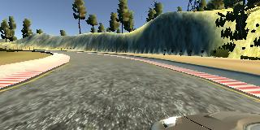
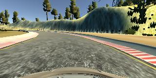
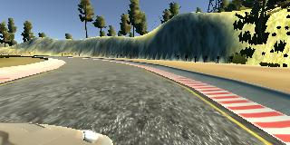

# Behavioural Cloning

> **Use Deep Learning to Clone Driving Behavior** by building a convolution neural network in Keras that predicts steering angles from images, and is trained, validated and tested with the appropriate data sets. In the end the trained model should be able to drive the simulation around track one (optionally track two). The work is reported in this README.

## Rubric Points

The following checklist needs to be implemented in order for the project to succeed.

### Files Submitted & Code Quality

- [ ] 1. The submission includes a `model.py` file, `drive.py`, `model.h5` a writeup report (`README.md`) and `video.mp4`.

- [ ] 2. The model provided can be used to successfully operate the simulation.
- [ ] 3. The code in `model.py` uses a Python generator, if needed, to generate data for training rather than storing the training data in memory. The `model.py` code is clearly organized and comments are included where needed.

### Model Architecture and Training Strategy

- [ ] 1. The neural network uses convolution layers with appropriate filter sizes. Layers exist to introduce nonlinearity into the model. The data is normalized in the model.
- [ ] 2. Train/validation/test splits have been used, and the model uses dropout layers or other methods to reduce overfitting.
- [ ] 3. Learning rate parameters are chosen with explanation, or an Adam optimizer is used.
- [ ] 4. Training data has been chosen to induce the desired behavior in the simulation (i.e. keeping the car on the track).

### Architecture and Training Documentation

- [ ] 1. The `README` *thoroughly* discusses the approach taken for deriving and designing a model architecture fit for solving the given problem.
- [ ] 2. The `README` provides sufficient details of the characteristics and qualities of the architecture, such as the type of model used, the number of layers, the size of each layer. Visualizations emphasizing particular qualities of the architecture are encouraged. [Here](http://alexlenail.me/NN-SVG/LeNet.html) is one such tool for visualization.
- [ ] 3. The `README` describes how the model was trained and what the characteristics of the dataset are. Information such as how the dataset was generated and examples of images from the dataset must be included.

### Simulation

- [ ] No tire may leave the drivable portion of the track surface. The car may not pop up onto ledges or roll over any surfaces that would otherwise be considered unsafe (if humans were in the vehicle).

###  Stand Out!

- [ ] The simulator contains two tracks. To meet specifications, the car must successfully drive around track one. Track two is more difficult. See if you can get the car to stay on the road for track two as well.

## Notes

- Sample Data: there is sample driving data available in the workspace but this needs augmentation and additional data from driving myself.
- Simulator: use mouse, R shorcut for recording. W or S suspend auto mode. Use smallest and fastest screen setting in simulator
- Data collection:
  - the car should stay in the center of the road as much as possible but we probably need
    - two or three laps of center lane driving
    - one lap of recovery driving from the sides
    - one lap focusing on driving smoothly around curves
  - if the car veers off to the side, it should recover back to center
  - driving counter-clockwise can help the model generalize
  - flipping the images is a quick way to augment the data
  - collecting data from the second track can also help generalize the model
  - we want to avoid overfitting or underfitting when training the model
  - knowing when to stop collecting more data
- steering is from -1 to 1 (tanh ?) in simulator angle of -25 to 25 degree
- three camera viewpoints per timestamp + sensor data. steering only concidered in this project
- can use scp to copy training data from local simulator to remote GPU instance
- If model predictions are poor on both the training and validation set (for example, mean squared error is high on both), then this is evidence of underfitting. Possible solutions could be to
  - increase the number of epochs
  - add more convolutions to the network.
- When the model predicts well on the training set but poorly on the validation set (for example, low mean squared error for training set, high mean squared error for validation set), this is evidence of overfitting. If the model is overfitting, a few ideas could be to
  - use dropout or pooling layers
  - use fewer convolution or fewer fully connected layers
  - collect more data or further augment the data set
- Augment by flipping, brightness etc the data (and angle) with keras tf.image features
- use side images and add correction to steering maybe even trig function to generate values (Project, Concept 13)
- preprocess images by cropping top 70 and bottom 25, Cropping2D(cropping=((70,25),(0,0)))
- start with simple network to check basic setup/workflow, then try e.g Lenet or something else to improve. then simultanously try preprocessing techniques

## Writeup

### Workflow

Two clones of the project exist, one in the Udacity workspace and the other on a local machine which both point to the main [repository](https://github.com/joustava/CarND-Behavioral-Cloning-Project). Collection of training data was done on a local MacBook Pro (2013) and training of the model is done on the GPU enabled workspace. Other tasks which do not require a GPU, such as major coding tasks, documenting, graphing and the writeup were done locally as to not waste GPU time.

Collection of data is done via a simulator, one needs to drive the car around the track using several driving tactics while recording. This data then has been uploaded as a compressed zip file to the GPU enabled workspace. On the workspace, this file has been unpacked in the `/opt` directory.

Each newly trained model is saved as `./models/model.h5`and as to not overwrite older models the previous files are backed up with their modification timestamp in the file name e.g `model_1607426211.5h`

### Files Submitted & Code Quality

#### 1. Submission includes all required files and can be used to run the simulator in autonomous mode

My project includes the following required files:
* `./src/model.py` containing the script to create and train the model
* `./tools/drive.py` for driving the car in autonomous mode
* `./models/model.h5` containing a trained convolution neural network 
* `README.md` summarizing the results (this is what you are reading right now)

The major structure of my project files summarized:

```bash
.
├── .gitignore 						# configured as to not upload huge amount of unnecessary data
├── LICENSE
├── Makefile							# helper targets for the make utility
├── data									# this is not committed but compressed and uploaded to /opt
│   ├── IMG								# camera images
│   └── driving_log.csv		# sensor log
├── models								# contains trained models
│   └── .gitkeep
├── src										# Code to train and create models
│   ├── augmentation.py
│   ├── data.py
│   ├── data_stream.py
│   └── model.py
└── tools									# the original provided tools for simulation and recording
    ├── drive.py
    └── video.py
```


#### 2. Submission includes functional code

Using the Udacity provided simulator in an appropriate workspace  and the `./tools/drive.py` file, the car can be driven autonomously around the track by executing 

```sh
$ python drive.py model.h5
```

or

```bash
$ make test_model
```

The car in the simulator will then start driving and attempt to navigate around the track without leaving the road.

#### 3. Submission code is usable and readable

The `./scr/model.py` file contains the code for training and saving the convolution neural network. The file shows the pipeline I used for training and validating the model, and it contains comments to explain how the code works. Major functionality such as loading data, saving the models and generating test data has been split up into independent files and imported into `./src/model.py` accordingly. These files are also extensively commented or documented.

### Model Architecture and Training Strategy

#### 1. An appropriate model architecture has been employed

My model consists of a convolution neural network with 3x3 filter sizes and depths between 32 and 128 (model.py lines 18-24) 

The model includes RELU layers to introduce nonlinearity (code line 20), and the data is normalized in the model using a Keras lambda layer (code line 18). 

#### 2. Attempts to reduce overfitting in the model

The model contains dropout layers in order to reduce overfitting (model.py lines 21). 

The model was trained and validated on different data sets to ensure that the model was not overfitting (code line 10-16). The model was tested by running it through the simulator and ensuring that the vehicle could stay on the track.

#### 3. Model parameter tuning

The model used an adam optimizer, so the learning rate was not tuned manually (model.py line 25).

#### 4. Appropriate training data

Training data was chosen to keep the vehicle driving on the road. I used a combination of center lane driving, recovering from the left and right sides of the road ... 

For details about how I created the training data, see the next section. 

### Architecture and Training Documentation

#### 1. Solution Design Approach

The overall strategy for deriving a model architecture was to incrementally build, train, validate a model and subsequently test the model on the simulator whenever there was significant improvement in accuracy.


#### Basic network

The first step was to create a basic project setup for loading the sample data, preparing and preprocessing the data and then train a simple network which only consisted of only a few layers

```python
# ... omitted
model = Sequential()
# Preprocess
model.add(Lambda(lambda x: x/127.5 - 1.,
                 input_shape=input_shape, output_shape=input_shape))
# Layers
model.add(Flatten())
model.add(Dense(1))
model.compile(loss='mse', optimizer='adam')
# ... omitted
```

The produced model can be found in [`./models/model01.h5`](./models/model01.h5) and the first iteration of the source code in repository [tag model01](https://github.com/joustava/CarND-Behavioral-Cloning-Project/tree/model01). The model did not do well in the simulator, after about 20 seconds the car drove of track into the woods and the model was driving very unsure, steering all over the place.

#### LeNet based network

Secondly a LeNet based network was build and trained with the original data. This model was conciderable more certain in steering and drove more stable for about 30 seconds. It started aiming for the red and white borders and got stuck on the right side 'concrete' ledge. Not a success either.

Before trying out a new neural network model additinal data was pulled into the training data in the form of the left and right camera feeds and their adjusted steering angles. Training on this data, which was tripled in size, did not reduce loss (around 1.1055 mostly) and thus a Dropout layer was added between each dense layer to reduce overfitting with a rate of 0.5. The training result looked like

```bash
112/112 [==============================] - 50s 443ms/step - loss: 0.0538 - val_loss: 0.0036
Epoch 2/10
112/112 [==============================] - 46s 414ms/step - loss: 0.0065 - val_loss: 0.0027
Epoch 3/10
112/112 [==============================] - 46s 412ms/step - loss: 0.0049 - val_loss: 0.0028
Epoch 4/10
112/112 [==============================] - 46s 412ms/step - loss: 0.0041 - val_loss: 0.0024
Epoch 5/10
112/112 [==============================] - 46s 412ms/step - loss: 0.0039 - val_loss: 0.0023
Epoch 6/10
112/112 [==============================] - 46s 413ms/step - loss: 0.0035 - val_loss: 0.0022
Epoch 7/10
112/112 [==============================] - 46s 412ms/step - loss: 0.0032 - val_loss: 0.0021
Epoch 8/10
112/112 [==============================] - 46s 413ms/step - loss: 0.0033 - val_loss: 0.0024
Epoch 9/10
112/112 [==============================] - 46s 412ms/step - loss: 0.0029 - val_loss: 0.0022
Epoch 10/10
112/112 [==============================] - 46s 412ms/step - loss: 0.0027 - val_loss: 0.0022
```

These look like good training results but again the simulator just drives on center for a while to then start tracking the road along the outside of the left bank. One more step to the data processing was added to crop the images such that the horizon above the road surface and the hood of the car were cropped from each image. The results of the training were similar to the training applied above, however the simulator still ran off track pretty soon.

```bash
name: Tesla K80, pci bus id: 0000:00:04.0)
112/112 [==============================] - 35s 310ms/step - loss: 0.0404 - val_loss: 0.0113
Epoch 2/10
112/112 [==============================] - 30s 267ms/step - loss: 0.0129 - val_loss: 0.0097
Epoch 3/10
112/112 [==============================] - 30s 268ms/step - loss: 0.0113 - val_loss: 0.0087
Epoch 4/10
112/112 [==============================] - 30s 268ms/step - loss: 0.0103 - val_loss: 0.0086
Epoch 5/10
112/112 [==============================] - 30s 268ms/step - loss: 0.0098 - val_loss: 0.0081
Epoch 6/10
112/112 [==============================] - 30s 267ms/step - loss: 0.0091 - val_loss: 0.0078
Epoch 7/10
112/112 [==============================] - 30s 268ms/step - loss: 0.0087 - val_loss: 0.0078
Epoch 8/10
112/112 [==============================] - 30s 270ms/step - loss: 0.0084 - val_loss: 0.0079
Epoch 9/10
112/112 [==============================] - 30s 270ms/step - loss: 0.0082 - val_loss: 0.0074
Epoch 10/10
112/112 [==============================] - 30s 270ms/step - loss: 0.0079 - val_loss: 0.0075
```

 These results made me start to inspect the data more closely. Predicted outputs for center, left and right images on this network were

```bash
TBD: Check from lenet branch
./assets/center_2020_12_08_10_46_19_361.jpg
# Car is near center of lane
CENTER:  [0.32672474] 
LEFT:      [0.20746137] 
RIGHT:     [0.35259765] 

 ./assets/left_2020_12_08_10_46_19_361.jpg
# Car is near 
CENTER:  [0.09711259] 
LEFT:      [-0.06863123] 
RIGHT:     [0.09685086] 

 ./assets/right_2020_12_08_10_46_19_361.jpg
CENTER:  [0.2572524] 
LEFT:      [0.22326781] 
RIGHT:     [0.20886575] 
```

Which look ok at a first glance. Next I created a plot of the training data to better visualize the training performance.


[TBD]

My first step was to use a convolution neural network model similar to the ... I thought this model might be appropriate because ...

In order to gauge how well the model was working, I split my image and steering angle data into a training and validation set. I found that my first model had a low mean squared error on the training set but a high mean squared error on the validation set. This implied that the model was overfitting. 

To combat the overfitting, I modified the model so that ...

Then I ... 

The final step was to run the simulator to see how well the car was driving around track one. There were a few spots where the vehicle fell off the track... to improve the driving behavior in these cases, I ....

At the end of the process, the vehicle is able to drive autonomously around the track without leaving the road.

#### 2. Final Model Architecture

The final model architecture (model.py lines 18-24) consisted of a convolution neural network with the following layers and layer sizes ...

Here is a visualization of the architecture (note: visualizing the architecture is optional according to the project rubric)

![alt text][image1]

#### 3. Creation of the Training Set & Training Process

To capture good driving behavior, I first recorded approximately three laps on track one using center lane driving, as good as my driving skills and simulator lag let me. Here is an example image of center lane driving where left, right and center are images from the same moment in time (2020-12-08 at 10:46:19.361 CET)

| Left Camera                                                  | Center Camera                                                | Right Camera                                                 |
| ------------------------------------------------------------ | ------------------------------------------------------------ | ------------------------------------------------------------ |
|  |  |  |


I then recorded the vehicle recovering from the left side and right sides of the road back to center so that the vehicle would learn to .... These images show what a recovery looks like starting from ... :

![alt text][image3]
![alt text][image4]
![alt text][image5]

Then I repeated this process on track two in order to get more data points.

To augment the data sat, I also flipped images and angles thinking that this would ... For example, here is an image that has then been flipped:

![alt text][image6]
![alt text][image7]

Etc ....

After the collection process, I had X number of data points. I then preprocessed this data by ...


I finally randomly shuffled the data set and put Y% of the data into a validation set. 

I used this training data for training the model. The validation set helped determine if the model was over or under fitting. The ideal number of epochs was Z as evidenced by ... I used an adam optimizer so that manually training the learning rate wasn't necessary.


## Resources

* https://github.com/udacity/CarND-Behavioral-Cloning-P3
* https://github.com/udacity/CarND-Term1-Starter-Kit
* http://images.nvidia.com/content/tegra/automotive/images/2016/solutions/pdf/end-to-end-dl-using-px.pdf
* https://developer.nvidia.com/blog/deep-learning-self-driving-cars/ (web version of above)